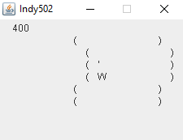

# Indy502

Java clone of Indy502, a TI83 game written in Basic.

TI83 original game name Indy502 probably refers to the 1989 car simulation game "Indianapolis 500: The Simulation".

This clone uses the Game Loop pattern. Explanations at : [https://java-design-patterns.com/patterns/game-loop](https://java-design-patterns.com/patterns/game-loop)

## Build

```bash
mvn clean package
```

## Launch

```bash
java -jar Indy502.jar
```

## Screenshot



## Contributing

Pull requests are welcome. For major changes, please open an issue first to discuss what you would like to change.
